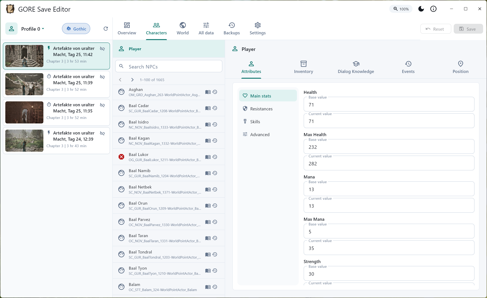

# GORE

**GORE** (Go-thic Re-make) is a modding and save-editing toolsuite for the
Gothic Remake.

## What's in the repo

- **[`gore`](crates/gore) CLI** (`gore.exe`) — the one binary that does *all*
  modding from the terminal: item values, text/dialogs, audio, textures,
  scripts. Start here if you want to mod. **⚗️ Ready for experimental use.**
- **[`mod-studio`](apps/mod-studio)** — a no-code Windows GUI over the same
  modding engine (incl. experimental AngelScript editing), for *authoring* one
  mod. **🚧 Work in progress.**
- **[`mod-manager`](apps/mod-manager)** — a Windows GUI for installing and
  managing *many* mods together (load order, conflict detection, one-click
  apply); complements mod-studio (authoring). **🚧 Work in progress.**
- **[`save-editor`](apps/save-editor)** — a Windows GUI for editing your save
  files (a separate job from modding — it never touches the game install).
  **✅ Ready to use.**
- **[`gore-lua`](lua)** — a small Lua helper library that ships into the game,
  for hand-writing UE4SS mods. **🚧 Work in progress.**
- **Supporting Rust crates** — the format codecs and data models the above
  share (see [Projects / layout](#projects--layout)), plus example mods under
  [`mods/`](mods).

The Flutter GUIs reuse the exact same Rust crates as the CLI through a
`dart:ffi` bridge — the CLI is always the most complete surface.

---

# Modding with the `gore` CLI

This is the full how-to-mod guide. Every domain below is driven entirely from
the `gore` binary — no GUI required.

Get the binary by building it (`cargo build --release -p gore` →
`target/release/gore`) or downloading a `gore-cli-v*`
[release](https://github.com/dh0er/gore/releases). Examples below assume
`gore` is on your `PATH` and use `"$GAME"` for your install root (the folder
that contains `G1R/`). The exact `--game`/path each subcommand expects is always
in `gore <cmd> --help`.

Set the game path once and skip `--game` everywhere:

```sh
gore config set game-path "$GAME"   # an install root or the game .exe
gore config detect                  # …or auto-detect a Steam install & save it
gore config list                    # show the stored value + resolved root
```

Every command that needs the game (`deploy-shared`, `mod`, `mgr`, `texture`,
`loc`) then resolves it automatically. Precedence is an explicit `--game` (or
`--lcache` for `loc`) > the configured path > Steam auto-detect. The path is
stored in a shared `config.json` (`gore config path`) that the GUI apps read
too, so you configure the install in one place.

Each domain produces a mod a different way:

| Domain | Mechanism | Touches |
|--------|-----------|---------|
| Item/stat values | UE4SS Lua CDO override, applied at runtime | a new mod folder under `ue4ss/Mods/` |
| Text & dialogs | re-encrypted `.lcache` | the localization cache, in place |
| Audio | re-packed FMOD `.bank` | the sound bank, in place |
| Voice-over | copy-on-write localized ZIP edit | the selected language archive, in place |
| Textures | additive UE5 IoStore Zen triplet | the game's `~mods/` folder |
| Scripts | edited precompiled AngelScript cache | the script cache (experimental) |

You can ship each on its own, or combine them into one deployable
**bundle** (see [Bundling & deploying](#bundling--deploying)).

## Item & stat values (overrides)

Change any default value on an item/NPC/ability class — weapon damage, item
value, weight, etc. Write an `overrides.toml`:

```toml
[meta]
name = "MyBalanceMod"
delay_ms = 0            # 0 = apply on first tick; >0 = apply after N ms

[[override]]
class = "ItFo_Apple"    # AngelScript class name
field = "m_Value"
value_int = 500

[[override]]
class = "ItMw_1H_Sword_01"
field = "m_Weight"
value_float = 1.5
```

Compile it into a runtime UE4SS Lua mod, written straight into the game:

```sh
gore gen overrides.toml -o "$GAME/G1R/Binaries/Win64/ue4ss/Mods"
# optional: validate field names/types against a reflection model first
gore gen overrides.toml -o "$GAME/.../Mods" --model model.json
```

The emitted mod looks up each class's CDO
(`StaticFindObject("/Script/<module>.Default__<class>")`) and sets the field at
load. It is self-contained — it does **not** need the gore-lua helpers.

**Finding class & field names.** Item/NPC/knowledge classes are listed in the
bundled catalogs (`apps/save-editor/assets/*_catalog.json`). To (re)generate the
data model yourself from a UE4SS dump:

```sh
gore catalog --kind item "UE4SS_ObjectDump.txt" -o item_catalog.json   # also: npc, knowledge
gore dump   "CXXHeaderDump/" -o model.json        # field schema (types) for validation
gore stubs  model.json -o stubs/                  # optional LuaLS/EmmyLua type stubs
```

For the *real* in-game default values (so the GUI/editor shows accurate
numbers), run the `gore-dump` mod in-game, then fold its output back in:

```sh
gore dump-mod --model model.json --catalog item_catalog.json -o "$GAME/.../Mods"  # generate the mod
# …launch the game once with it enabled → writes gore_game_data.json…
gore sync --dump gore_game_data.json --catalog item_catalog.json -o model.json
```

## Text & dialogs (localization)

All UI text and NPC dialog lines live in the encrypted AlkimiaLocalization
`.lcache`. Decrypt every language to JSON, edit, re-encrypt:

```sh
gore loc export --lcache "$GAME/.../AlkimiaLocalization_Game.lcache" -o loc.json
# edit loc.json:  { "some_text_id": { "german": "Neuer Text", "english": "New text" }, … }
gore loc import --lcache "$GAME/.../AlkimiaLocalization_Game.lcache" --edits loc.json
# Explicitly allow IDs that are not in the original cache (needed by new dialogs/quests):
gore loc import --lcache "$GAME/.../AlkimiaLocalization_Game.lcache" \
                --edits new-dialog.json --add-missing
```

`gore loc import` overwrites the cache in place (pass `-o` to write elsewhere) —
keep a copy first, or use the [bundle](#bundling--deploying) path, which backs up
to `*.gore-bak`. Unknown IDs are rejected unless `--add-missing` is present;
bundle/Mod Studio projects treat a newly authored localization ID as an explicit
add operation. In Mod Studio's Dialogs tab, the add button creates a new
`info_`/`dia_`/`gvl_`/`svm_` line in the currently selected game language.
Helpers: `gore loc extract` auto-detects the game and writes the shared catalog;
`gore loc status` shows what's loaded.

Localization supplies captions and spoken lines; it does not by itself create a
selectable conversation topic. Compile the topic class and declare its guarded
runtime registration as described in
[AngelScript dialog authoring](docs/dialog-authoring.md).

## Audio

The game's sounds and music are encrypted FMOD `.bank` files at
`$GAME/G1R/Content/FMOD/Desktop/*.bank`. `gore audio` reads and replaces samples
in pure Rust (no FMOD install needed).

```sh
gore audio list    --bank "$GAME/.../SFX.bank"               # name, codec, rate, channels, length
gore audio extract --bank "$GAME/.../SFX.bank" -o wavs/      # all samples to .wav (or --sample NAME)
# map.json:  { "SampleName": "path/to/new.wav", … }
gore audio replace --map map.json --bank "$GAME/.../SFX.bank"   # in place, *.gore-bak backup
gore audio restore --bank "$GAME/.../SFX.bank"                  # undo from *.gore-bak
```

Replacement re-encodes your WAV as PCM16 in an appended sub-bank and repoints the
sample — any length, no whole-bank re-encode. Share a patch without shipping game
audio:

```sh
gore audio export-patch --map map.json -o patch.zip
gore audio apply-patch  --patch patch.zip --bank "$GAME/.../SFX.bank"
```

### Voice-over ZIP archives

Localized dialog recordings are Ogg files in language ZIPs under
`$GAME/G1R/Story/VoiceOver` (for example `german_new.zip`). `gore voice` can
index them, safely extract one recording, or create a new archive with one Ogg
added/replaced:

```sh
VO="$GAME/G1R/Story/VoiceOver/german_new.zip"
gore voice list --archive "$VO"                         # `index` is an alias
gore voice list --archive "$VO" --json                  # machine-readable index
gore voice extract --archive "$VO" --basename DIA_X.ogg -o extracted/
# Real archives contain duplicate basenames; select those by their case-sensitive full path:
gore voice extract --archive "$VO" --path "NPC/Quest/DIA_X.ogg" -o extracted/
gore voice replace --archive "$VO" --path "NPC/Quest/DIA_X.ogg" \
                   --ogg new.ogg -o german_replaced.zip
gore voice add --archive "$VO" --path "GoreMods/MyMod/DIA_NEW.ogg" \
               --ogg new.ogg -o german_added.zip
```

For a distributable multi-file patch, use the versioned manifest format. A
format-1 manifest contains an ordered, non-empty `edits` array:

```json
{
  "format": 1,
  "edits": [
    {
      "op": "replace",
      "path": "NPC/Quest/DIA_X.ogg",
      "ogg": "files/DIA_X.ogg"
    },
    {
      "op": "add",
      "path": "GoreMods/MyMod/DIA_NEW.ogg",
      "ogg": "files/DIA_NEW.ogg"
    }
  ]
}
```

```sh
gore voice apply-manifest --archive "$VO" --manifest voice-patch.json \
                          -o german_patched.zip
# `gore voice apply` is a shorter alias.
```

Manifest `path` values are complete archive paths. Replacements match them
exactly and case-sensitively; basename selectors are intentionally unavailable
in manifests. Each `ogg` value is a portable `/`-separated path relative to the
manifest. Absolute paths, empty/`.`/`..` components, backslashes, symlinks,
Windows reparse points, and paths escaping the manifest directory are rejected.
The command rejects unknown format versions/operations and case-insensitive
duplicate targets, then reads and validates every Ogg before applying the whole
ordered batch in one verified archive pass. Replacements keep their original
slots; additions are appended in manifest order. Any error publishes no output.

`--basename` is case-insensitive but succeeds only when it is unique;
`--path` is an exact, case-sensitive archive path. Extract never overwrites an
existing file. Add/replace never modify their input and require a new `--out`
path that does not exist. They validate the Ogg stream and the completed ZIP
before publishing it, and reject unsafe paths, symlinks, encrypted entries, and
resource-limit violations. These commands create an archive; they do not install
it into the game.

## Textures

Replace any `Texture2D` packed in the UE5 IoStore container. Output is an
**additive** Zen triplet (`.utoc`/`.ucas`/`.pak`) dropped into the game's
`~mods/` folder — no original game file is modified.

```sh
gore texture list    --game "$GAME" --filter T_Hardware           # find asset paths
gore texture extract --game "$GAME" /Game/UI/Textures/Common/T_HardwareCursor -o cur.png
# edit cur.png (RGBA8/RGB8; dimensions need not match the original)
gore texture replace --game "$GAME" /Game/UI/Textures/Common/T_HardwareCursor \
                     --image new.png --mod-dir moddir/
gore texture pack    --game "$GAME" --mod-dir moddir/ --name zzz_MyMod_P -o out/
gore texture deploy  --game "$GAME" --triplet-dir out/ --name zzz_MyMod_P
gore texture undeploy --game "$GAME" --name zzz_MyMod_P            # remove it
```

(`gore texture index` builds/caches the asset→package-id map used to resolve
assets. Compression is opt-in via `--compress` on `pack`, but uncompressed
containers are what currently load reliably in-game.)

### Cooked DataAsset foundation

`gore-asset` is the conservative backend for a future generic cooked-DataAsset
editor. It can resolve and flatten class schemas from a `.usmap`, decode and
re-encode Unreal unversioned-property headers, and edit fixed-width primitive
properties without changing unrelated bytes. Its package carrier loads a split
`.uasset`/`.uexp` pair, permits only bounds-checked same-length replacement, and
writes a verified new pair without overwriting the input or an existing output.

There is intentionally no guessed property-stream offset and no general CLI
edit command yet. Against the current hotfix, three native `UPrimaryDataAsset`
packages reproduce byte-identically and their Zen/legacy export maps prove the
exact `.uexp` export ranges plus package footer. A UE5.4-G1R envelope API now
validates those boundaries and retains every class-native suffix opaquely. The
apparent four-byte prefix was actually two legal empty unversioned-header
fragments; the decoder now accepts and round-trips them. The first real non-zero
properties are complex `Map`/`Struct` values. A resource-bounded
span walker now follows the USMAP recursively for the wire forms proven by those
fixtures (`Map`, nested G1R structs, names/object references, `LinearColor`,
`Vector4`, and required primitives), returning exact borrowed byte ranges and a
consumed count. A snapshot-sealed `FixedLeafPatch` can replace proven
same-width numeric/Bool leaves by semantic property path, with full-pair drift
checks, exact-schema rewalks, compare-and-swap mutation, and verified rollback.
Reference edits, map keys, variable-width values, and structural collection or
header changes remain intentionally unsupported. Unknown forms fail typed
before any size is guessed.

## Scripts (AngelScript) — experimental

The game's compiled AngelScript lives in a precompiled cache
(`PrecompiledScript_Shipping.Cache`). `gore as` can read it and splice edited
modules back in. This is reverse-engineering-stage tooling; a compiled module
can also be folded into a deployable bundle (see
[Bundling & deploying](#bundling--deploying)).

```sh
gore as info       PrecompiledScript_Shipping.Cache         # module count + splice point
gore as decompile  PrecompiledScript_Shipping.Cache <needle>   # → readable AngelScript
gore as emit-all   PrecompiledScript_Shipping.Cache out_as/    # all modules as recompilable .as
gore as disasm     PrecompiledScript_Shipping.Cache <needle>   # asBC bytecode listing
```

### Recompiling: the game is the compiler

There is no standalone AngelScript compiler — the shipping game **is** the
compiler. Its executable takes a command-line flag,
**`-as-generate-precompiled-data`**, which makes it read the loose `.as` scripts
under `<install>/G1R/Script/`, compile them, and (over)write
`PrecompiledScript_Shipping.Cache` in that same folder.

`gore as compile` wraps that flag as an ordinary compiler: give it a source tree
and (optionally) an output path, and it does the file juggling — backup, staging
into `Script/`, launching the game, then restoring the install — itself. The
install is resolved from `--game`, else the configured game path / Steam
auto-detect.

```sh
# dump the vanilla modules as an editable .as tree:
gore as emit-all "$GAME/G1R/Script/PrecompiledScript_Shipping.Cache" out_as/
# …edit modules in out_as/ …

# compile the tree to a cache file, leaving the install untouched:
gore as compile out_as/ -o regen.Cache --game "$GAME"
# …or install the fresh cache in place (previous one saved to *.gore-bak):
gore as compile out_as/ --game "$GAME"
# with no source tree, recompile whatever `.as` are already in Script/:
gore as compile --game "$GAME"
```

On Windows, compile automatically attempts the embedded, temporary x86-64 diagnostics hook. When
the selected AMD64 executable has exactly one raw masked callback match and its sparse
`asSMessageInfo` structure fingerprint verifies, errors are printed like a normal compiler
(`file:line:column: error: message`), with candidate signatures retained as notes. The helper is
never installed into the game. A missing/changed/ambiguous signature, structural mismatch, or
confirmed hook failure falls back to the unchanged generator; use `--no-diagnostics` for a silent
explicit opt-out.
Compatibility can be audited without launching the game, including custom/non-Steam executables:

```sh
gore as diagnostics-check --game "$GAME"
gore as diagnostics-check --exe "D:/Custom/G1R/Binaries/Win64/G1R-Win64-Shipping.exe"
```

The check reports executable SHA-256, raw match count, matched RVA(s), and callback-structure
verification. An advanced, explicitly trusted helper override is available through
`--diagnostics-hook DLL` or
`GORE_AS_DIAGNOSTICS_HOOK`; the embedded/sibling release helper is SHA-256 verified.
The currently embedded helper has passed both a full-tree positive compile and an intentional
compiler-error run on the installed 1.0.3 executable. Archived 1.0.0--1.0.3 executables pass the
same offline signature and structure audit; only installed 1.0.3 has been runtime-injected.

The `-o` form leaves the install exactly as it was, so the live
`PrecompiledScript_Shipping.Cache` is still the pristine `vanilla.Cache` below.
For the normal one-file authoring workflow, let the high-level command perform
the emit/overlay/compile/extract/remap chain and return a deployable mini-cache:

```sh
gore as compile-module --op add --module MyMod.Dialog \
  --rel-path MyMod/Dialog.as --source Dialog.as --work-dir .gore-as-work \
  --allow-new-symbols -o MyMod.Dialog.mini.Cache --game "$GAME"
```

`compile-module` is the CLI equivalent of Mod Studio's Compile action and
restores the game install after the compiler run. For debugging or custom
pipelines, the same stages remain available as low-level commands. Rather than
shipping a whole regenerated cache, splice just the edited module back into the
vanilla one:

```sh
# existing module — remap refs to the vanilla cache, then replace in place:
gore as extract-remap regen.Cache <Module> vanilla.Cache -o mini.Cache
gore as replace       vanilla.Cache mini.Cache <Module>  -o modded.Cache
# new class/function-bearing module — carry only genuinely new symbol rows:
gore as extract-remap regen.Cache <Module> vanilla.Cache \
                      --allow-new-symbols -o mini.Cache
gore as splice        vanilla.Cache mini.Cache -o modded.Cache
```

`--allow-new-symbols` is deliberately opt-in. Existing references are still
mapped back to the vanilla cache; only rows for classes/functions/names that do
not exist there are retained, with collision checks before deployment. Mod
Studio defaults it on for a **New module** and off for an edit; an existing-module
edit can enable it explicitly when it intentionally adds a class or function.

The complete new-dialog visual path has been validated in game with both the
reviewed fixture and the exact adapter emitted by the declarative production
generator. See
[AngelScript dialog authoring](docs/dialog-authoring.md) for the compiled topic
template, runtime evidence, safe test order, and the important boundary between
a renderable new class and automatic topic discovery.

Decompilation/emit resolve native-call arities from a `Binds.Cache` placed next
to the input cache (or `GORE_AS_BINDS`).

## Bundling & deploying

Combine overrides + text + audio + voice archives + textures + scripts/dialog topics into one mod, then
deploy/undeploy it against your install. Write a build spec (`spec.json`):

```json
{
  "meta": { "name": "MyMod", "version": "1.0.0", "author": "you" },
  "overrides": [ { "class": "ItFo_Apple", "field": "m_Value", "value_int": 500 } ],
  "loc_edits": { "some_text_id": { "german": "…" } },
  "audio":   [ { "bank": "SFX.bank", "sample": "Foo", "wav_path": "foo.wav" } ],
  "voice":   [ { "archive": "german_new.zip", "op": "replace", "archive_path": "NPC/Hero/DIA_Foo.ogg", "ogg_path": "DIA_Foo.ogg" } ],
  "texture": [ { "asset": "/Game/UI/.../T_Foo", "image_path": "foo.png" } ],
  "scripts": [ { "op": "add", "module_name": "MyModule", "mini_cache": "MyModule.cache" } ],
  "dialog_topics": [ { "id": "viper-test", "participant_name": "om_stt_viper_302", "topic_class": "/Script/Angelscript.ChoiceMyViper", "sentinel_class": "/Script/Angelscript.ChoiceStt302ViperExit" } ]
}
```

```sh
gore mod build   --spec spec.json -o build/            # → build/MyMod/ (gore-mod.json manifest + payloads)
gore mod deploy  --bundle build/MyMod --game "$GAME"   # overrides→Mods, loc/audio/voice in place (*.gore-bak), textures→~mods
gore mod undeploy --game "$GAME"                       # restore everything
```

Voice entries are packaged into a versioned format-1 `voice/manifest.json` with
bundle-relative validated Ogg payloads. `archive` must be one `.zip` filename
under `G1R/Story/VoiceOver`; `archive_path` is a forward-slash `.ogg` member.
`replace` requires that member's exact case-sensitive stored path; `add` requires
it not to exist. Exact-path replacement is mechanically verified by archive and
transactional deploy tests. `add` is archive-safe, but whether the game resolves
a brand-new voice path is still runtime-dependent; replacements are the
established deployment path.
Direct deploy and manager apply group edits into one verified rewrite per ZIP
and always rebuild from the pristine/prior-backup archive. Manager collisions
on `(archive, archive_path)` are case-insensitive, soft, order-dependent, and
later-wins while retaining the winning spelling and operation. A referenced
archive missing from the install is a hard preflight error: deployment refuses
to create a partial voice patch. All manifests, payload paths, files, and Oggs
are validated before an active manager loadout is transactionally replaced.

Each candidate ZIP is streamed to a private disk file and fully verified before
the transaction publishes it. Memory is bounded by the retained source-Ogg
budget (256 MiB for a direct bundle build/deploy) plus the ZIP index/streaming
state, rather than by the combined output size of all language archives.
Rollback snapshots and candidates are durable same-directory temporary files,
so the game volume needs temporary free space comparable to the archives being
replaced. Insufficient memory or disk space fails before a live archive is
changed.

This is the same engine [`mod-studio`](#gore-mod-studio) drives. Other helpers:

```sh
gore scaffold MyMod -o "$GAME/.../Mods"   # empty hand-written gore-lua mod skeleton
gore deploy-shared --game "$GAME"         # install the gore-lua helpers (for custom Lua mods)
gore package mod_dir/ -o MyMod.zip        # zip a Lua mod for sharing
```

## CLI reference

Every subcommand of the `gore` binary:

| Command | Action(s) | Purpose |
|---------|-----------|---------|
| `config` | `set` · `get` · `unset` · `list` · `path` · `detect` | Persist shared settings (the game path) so other commands can omit `--game`. |
| `gen` | — | Compile `overrides.toml` → a UE4SS Lua override mod. |
| `mod` | `build` · `deploy` · `undeploy` | Build/deploy/undeploy a unified bundle (overrides + loc + audio + voice ZIPs + textures + scripts + guarded dialog-topic registration). |
| `mgr` | `import` · `list` · `enable` · `disable` · `order` · `analyze` · `apply` · `status` · `reset` · `remove` | Multi-mod manager: library, load order, conflict analysis, composed deploy (the CLI behind mod-manager). |
| `loc` | `extract` · `status` · `export` · `import` | Read/edit localized text & dialogs in the encrypted `.lcache`. |
| `audio` | `list` · `extract` · `replace` · `restore` · `export-patch` · `apply-patch` | Read/replace FMOD `.bank` audio (PCM injection, `*.gore-bak`). |
| `voice` | `list` (`index`) · `extract` · `add` · `replace` · `apply-manifest` (`apply`) | Index/extract/copy-on-write edit localized voice-over ZIP archives. |
| `texture` | `list` · `extract` · `replace` · `pack` · `deploy` · `index` · `undeploy` | Extract/replace IoStore textures → Zen triplet in `~mods`. |
| `as` | `compile` · `compile-module` · `diagnostics-check` · `info` · `decode-header` · `walk` · `decompile` · `disasm` · `emit` · `emit-all` · `replace` · `splice` · `extract` · `extract-remap` | AngelScript precompiled-cache tooling: recompile `.as` via the game, capture compiler diagnostics when safely available, decode/emit/decompile/splice modules (experimental). |
| `catalog` | `--kind item\|npc\|knowledge` | Generate a catalog JSON from a UE4SS object dump. |
| `dump` | — | Parse a UE4SS SDK header dump into a reflection model JSON. |
| `stubs` | — | Emit LuaLS/EmmyLua type stubs from `model.json`. |
| `gui-model` · `sync` · `dump-mod` | — | Build/refresh the data model (incl. real in-game defaults via the `gore-dump` mod). |
| `scaffold` | — | Create a hand-written gore-lua mod skeleton. |
| `deploy-shared` | — | Install the gore-lua helpers into `ue4ss/Mods/shared`. |
| `package` | — | Zip a mod folder into distributable UE4SS layout. |

---

# GORE Mod Studio 🚧

> **Work in progress** — not yet ready for general use. For stable modding today,
> use the [`gore` CLI](#modding-with-the-gore-cli).

A no-code Windows app over the same bundle engine as the CLI — point-and-click
modding with live previews and `.goremod` project files. Auto-updates on launch
(WinSparkle). The install bundles the [`gore` CLI](#modding-with-the-gore-cli)
(`gore.exe`) alongside, for the power tools the GUI does not surface (AngelScript
`disasm`/`decompile`, `catalog`/`dump`/`stubs`, multi-mod `mgr`).

**It can:**
- Edit **item/stat values** by browsing the categorized item catalog and editing
  fields (the override domain).
- Edit **localized text and dialog-line IDs**, and stage selectable runtime
  topics with explicit participant, authored AngelScript class, and vanilla
  sentinel identities. The GUI preserves their insertion order and emits the
  same `BuildSpec.dialog_topics` contract as the CLI without inference.
- Replace **audio** — browse a bank's samples, preview, and swap in your own.
- Replace **textures** — pick an asset, preview, drop in a PNG.
- Edit **AngelScript** — stage a module, compile, and splice it into the game's
  script cache (experimental).
- **Build a bundle** and **deploy/undeploy** it to your game install
  (overrides + loc + audio + textures + scripts + dialog topics, with backups), or **export a
  standalone Lua override mod** to share.

**It can not:**
- Edit **save files** — that's [save-editor](#gore-save-editor).
- Hand-write custom Lua logic — use `gore scaffold` + the [gore-lua helpers](#gore-lua-helper-library).
- Patch arbitrary game files outside the five supported domains.
- Manage a *collection* of mods together — that's [mod-manager](#gore-mod-manager).

---

# GORE Mod Manager 🚧

> **Work in progress** — not yet ready for general use. For stable modding today,
> use the [`gore` CLI](#modding-with-the-gore-cli).

A Windows app for running **many** mods at once. Where [mod-studio](#gore-mod-studio)
*authors* a single mod, mod-manager owns the multi-mod story: build a library,
order it, see what collides, and apply the whole enabled set to your install.
Auto-updates on launch (WinSparkle). It consumes the mod bundles mod-studio (or
`gore mod build`) produces, plus foreign mods it did not build.

**It can:**
- **Import** into a local library: built mod-bundle folders/zips (with a root
  `gore-mod.json`), foreign mod zips/folders, loose `_P.pak` files, IoStore
  triplets (`.utoc`/`.ucas`/`.pak`), UE4SS Lua mod folders, and raw game-file
  replacements.
- **Enable/disable** mods and **drag to reorder** the load order (later wins).
- **Detect conflicts** across mods — localization, audio, texture/asset, item
  overrides (CDO), scripts, and raw-file replacements — and show which mod wins.
- **Apply** declaratively: full-recompute the modded state from a pristine base
  and deploy the whole enabled set (backups first), or **undeploy all** to
  restore.
- **Take over** a mod-studio test-deploy so both tools do not fight over the
  install.

**It can not:**
- *Author* a mod (edit item values, text, audio, textures) — that's
  [mod-studio](#gore-mod-studio) or the [`gore` CLI](#modding-with-the-gore-cli).
- Edit **save files** — that's [save-editor](#gore-save-editor).
- Download mods (no Nexus API integration) — import files you already have.

---

# GORE Save Editor

A Windows app for editing your **save games**, backup-first. This is
*not* modding — it changes your saved progress, never the game install.
Auto-updates on launch (WinSparkle). Tested against Steam build CL168781; should
work across versions.

[](docs/images/screenshot_light.png)

**It can:**
- **Profile** — change difficulty settings; set the in-game time (play clock).
- **Player & NPCs** — edit stats, attributes, all talents/skills, location, and
  more; revive a dead NPC (restore health, strip the death state).
- **Inventory** — change counts of existing items; add new items from a bundled,
  categorized catalog; reset an
  inventory to a clean starting state.
- **Faction crimes** — clear an NPC's crimes to reset the hostility its guild
  holds against you.
- **Progression** — edit quest markers, NPC knowledge, and events.
- **Raw properties** — edit almost any internal property value directly
  (experimental; can corrupt a save).
- Write an automatic **backup** before every change.

**It can not:**
- Mod the game (no overrides, audio, textures, or scripts) — use the
  [`gore` CLI](#modding-with-the-gore-cli) or [mod-studio](#gore-mod-studio).
- Touch the game install in any way.
- Guarantee experimental raw edits are safe — keep your own copy of important
  saves.

---

# GORE Lua Helper Library 🚧

> **Work in progress** — a thin convenience layer, not a full SDK.

[`gore-lua`](lua) is a small shared UE4SS **helper library** for hand-writing
Gothic Remake mods in Lua — the path for behavior the override generator can't
express (hooks, keybinds, console commands, live attribute tweaks). It's a
handful of `pcall`-guarded wrappers over UE4SS reflection, not a large API.
Override mods produced by `gore gen`/`mod-studio` do **not** use it; it's for
custom mods.

How a mod uses it:

```sh
gore deploy-shared --game "$GAME"             # copy gore-lua into ue4ss/Mods/shared (once)
gore scaffold MyMod -o "$GAME/.../Mods"       # new mod with the loader wired in
```

```lua
local gore = require("gore-lua")           -- load the shared gore-lua helpers
gore.cheat.god(true)                       -- toggle god mode on the live CombatConfig + CDOs
gore.gas.heal()                            -- set Health to MaxHealth
gore.ui.text("hello from my mod")          -- on-screen message via the game's HUD
gore.cmd.command("mycmd", function() … end)-- register a console command
```

The API spans `gore.obj` (objects/CDOs/properties), `gore.player`
(controller/pawn/world), `gore.ui` (on-screen text + log), `gore.gas` (gameplay
attributes), `gore.cheat`, `gore.cmd` (commands/keybinds/game-thread), and
`gore.help`/`gore.selftest`. Every helper pcall-guards its reflection and returns
`nil`/`false` on failure — it never crashes the consuming mod. Full reference:
[`lua/README.md`](lua/README.md) (or `gore.help.list()` at runtime).

`gore deploy-shared` installs the helpers; UE4SS loads any mod folder containing
an `enabled.txt`.

---

# Projects / layout

```
gore/
├─ Cargo.toml              flat workspace (members = ["crates/*"])
├─ build.py                orchestrator: python build.py <project> build|run|dist|installer|test|release
├─ crates/
│  ├─ gore/                THE unified CLI binary (gore.exe)
│  ├─ gore-reflect/        UE reflection model + UE4SS SDK dump parser
│  ├─ gore-catalog/        item/npc/knowledge catalog model + pipelines
│  ├─ gore-loc/            AlkimiaLocalization .lcache crypto + game-dir discovery + shared paths
│  ├─ gore-modgen/         overrides.toml → UE4SS Lua mod generation + validation
│  ├─ gore-mod/            unified bundle engine (overrides + loc + audio + voice + textures + scripts)
│  ├─ gore-fmod/           FMOD .bank decrypt/parse + Vorbis (audio backend, pure Rust)
│  ├─ gore-vo/             safe voice ZIP index/extract/copy-on-write editor
│  ├─ gore-asset/          USMAP + unversioned-property + lossless package primitives
│  ├─ gore-tex/            UE5 IoStore texture extract/replace (Zen .utoc/.ucas/.pak)
│  ├─ gore-ffi/            cdylib dart:ffi bridge for mod-studio (gore_ffi.dll)
│  ├─ gore-save/           GSAV savegame parse/edit core + its cdylib (gore_save.dll)
│  ├─ gore-oodle/          Oodle/Kraken codec (pure Rust, no oo2core DLL)
│  └─ gore-as/             AngelScript precompiled-cache decoder/emitter/splicer (surfaced via `gore as`)
├─ apps/
│  ├─ save-editor/         Flutter (Windows) savegame editor — WinSparkle auto-update
│  ├─ mod-studio/          Flutter (Windows) no-code mod authoring GUI
│  └─ mod-manager/         Flutter (Windows) multi-mod library/load-order/apply GUI
├─ lua/                    gore-lua UE4SS helper library (deployed into the game's Mods/shared)
├─ mods/                   first-party UE4SS mod folders
│  ├─ example/             sample mod using gore-lua
│  └─ gore-dump/           generated dump mod (regen: `gore dump-mod`)
├─ vendor/
│  └─ retoc/               vendored IoStore reader fork (Oodle decode routed to gore-oodle)
├─ scripts/                release helpers (appcast.py — WinSparkle appcast generator)
└─ docs/
```

| Crate | Kind | What it does |
|-------|------|--------------|
| [`gore`](crates/gore) | Rust CLI (`gore.exe`) | The unified binary — see [CLI reference](#cli-reference). |
| [`gore-reflect`](crates/gore-reflect) | Rust lib | UE reflection model + UE4SS SDK dump parser. |
| [`gore-catalog`](crates/gore-catalog) | Rust lib | Item/NPC/knowledge catalog model + generation pipelines. |
| [`gore-loc`](crates/gore-loc) | Rust lib | AlkimiaLocalization `.lcache` crypto, game-dir discovery, shared paths. |
| [`gore-modgen`](crates/gore-modgen) | Rust lib | `overrides.toml` → UE4SS Lua mod generation + field-level validation. |
| [`gore-mod`](crates/gore-mod) | Rust lib | Unified bundle engine: `BuildSpec` → bundle (manifest + payloads) → deploy/undeploy. |
| [`gore-fmod`](crates/gore-fmod) | Rust lib | FMOD `.bank` decrypt/parse + Vorbis decode (audio backend; pure Rust). |
| [`gore-vo`](crates/gore-vo) | Rust lib | Safe voice ZIP indexing/extraction and verified copy-on-write Ogg add/replace. |
| [`gore-asset`](crates/gore-asset) | Rust lib | USMAP flattening, bounded read-only complex-property spans, unversioned primitive codec, and verified `.uasset`/`.uexp` carrier. |
| [`gore-tex`](crates/gore-tex) | Rust lib | IoStore texture extract/replace; cooks + packs a Zen triplet. Built on vendored [`retoc`](vendor/retoc) + `gore-oodle`. |
| [`gore-ffi`](crates/gore-ffi) | Rust cdylib | `dart:ffi` bridge for mod-studio (`gore_ffi.dll`) over the full mod engine. |
| [`gore-save`](crates/gore-save) | Rust lib + cdylib | GSAV savegame parse/edit core (`gore_save.dll`). |
| [`gore-oodle`](crates/gore-oodle) | Rust lib | Oodle/Kraken codec (pure Rust; no proprietary `oo2core` DLL). |
| [`gore-as`](crates/gore-as) | Rust lib | AngelScript precompiled-cache decoder/emitter/decompiler/splicer. |

# Build

## Requirements

- Windows 10 or newer.
- Rust toolchain (stable).
- Flutter with Windows desktop support (for the GUI apps).
- Visual Studio 2022 with "Desktop development with C++".
- Python 3 (drives `build.py` / `test.py`).

The local development setup used for this repository is Flutter 3.44.0, Dart
3.12.0, and Rust 1.96.0.

The Rust workspace spans every crate:

```sh
cargo build
cargo test
```

Products (apps and shippable artifacts) are driven by the top-level orchestrator.
The registered projects are **`gore-save`** (save-editor), **`gore-mod`**
(mod-studio), **`gore-manager`** (mod-manager), and **`gore`** (the CLI):

```sh
python build.py <project> build      # debug build
python build.py <project> run        # build if missing, then launch
python build.py <project> dist       # release bundle (+ packaged zip)
python build.py <project> installer  # dist + Windows installer
python build.py <project> test       # run the project's test suite
```

`python build.py all test` runs every project's suite (Rust `cargo test`, Python
tools, Flutter `analyze` + `test`). CI runs the equivalent checks via
[`apps/save-editor/test.py`](apps/save-editor/test.py) (invoked from that
directory) plus the mod-studio/mod-manager `analyze` + `test` steps. Per-project
build/run details live in each component's own README (e.g.
[`apps/save-editor/README.md`](apps/save-editor/README.md)).

## Versioning

Per-product independent semver, with prefixed release tags driving the Release
workflow:

- `save-editor` → `gore-save-v*` (publishes with `make_latest=true`; its updater
  polls `releases/latest`)
- `mod-studio` → `gore-mod-v*` (updater reads a fixed `gore-mod-appcast` release)
- `mod-manager` → `gore-manager-v*` (updater reads a fixed `gore-manager-appcast`
  release)
- the CLI → `gore-cli-v*`

Internal libraries share one workspace version.

# License

MIT. See [LICENSE](LICENSE).
