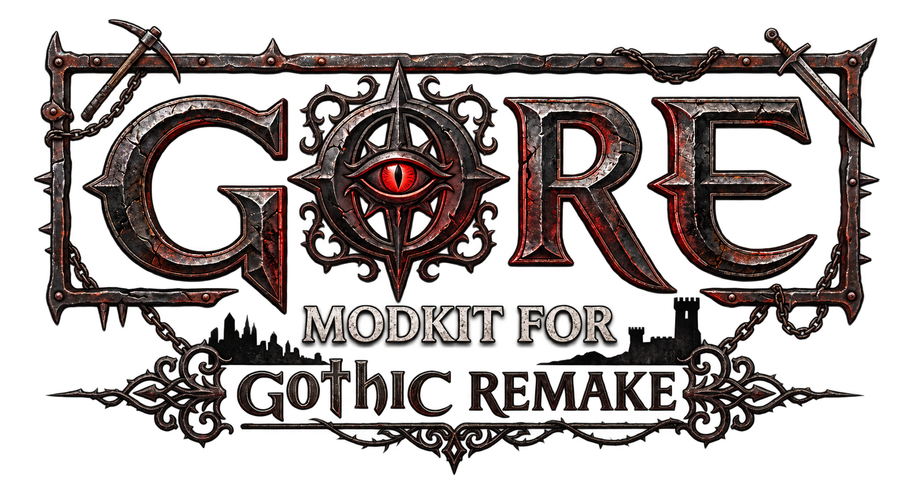
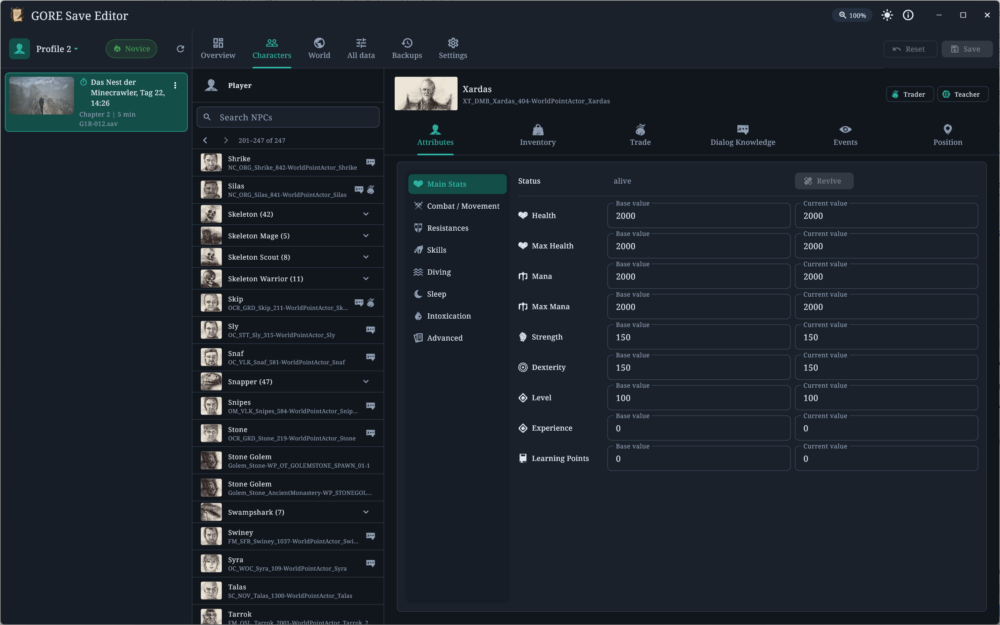

<p align="center">
  
</p>

<p align="center">
  <a href="https://github.com/dh0er/gore/actions/workflows/ci.yml"></a>
  <a href="https://github.com/dh0er/gore/issues"></a>
  <a href="https://github.com/dh0er/gore/blob/main/LICENSE"></a>
</p>

#

**GORE** (Go-thic Re-make) is a modding and save-editing toolkit for Gothic 1 Remake which works
completely without UE4SS. It comes with a plugin for your agents, so you can easily mod using AI.

In fact, the whole CLI is intended to be used by AI agents only. You can of course use it manually,
but except for this README, the whole documentation is written by AI and might be incomplete and/or
hard to understand.

A no-code GUI, Mod Studio, is planned for the future.

## 🧰 Tools

| Tool⠀⠀⠀⠀⠀⠀⠀⠀⠀⠀⠀⠀ | What it does | Status⠀⠀⠀⠀⠀⠀⠀⠀⠀⠀⠀⠀⠀ | Download |
|---|---|---|---|
| **[Save Editor](apps/save-editor/README.md)** | Windows GUI for editing savegames. | ✅ Ready to use | [1.5.0](https://github.com/dh0er/gore/releases/tag/gore-save-editor-v1.5.0) |
| **[CLI](docs/guide/README.md)** | All-in-one command-line tool for all modding tasks. | ⚗️ Experimental use | [0.4.0](https://github.com/dh0er/gore/releases/tag/gore-cli-v0.4.0) |
| **[Mod Manager](apps/mod-manager/README.md)** | Windows GUI for installing and ordering *many* mods together. | ⚗️ Experimental use | [0.2.0](https://github.com/dh0er/gore/releases/tag/gore-mod-manager-v0.2.0) |
| **[AI Plugins](plugins/gore/README.md)** | MCP server and skill for the CLI. | ⚗️ Experimental use | ⠀⠀⠀⠀⠀ |
| **[Mod Studio](apps/mod-studio/README.md)** | No-code Windows GUI over the GORE engine, for *authoring* mods. | 📋 Planned | ⠀⠀⠀⠀⠀ |

## 📊 Status

| Area | Status | What you can do | What's missing |
|---|---|---|---|
| [Savegames](apps/save-editor/README.md) | Mostly | Edit Player and NPC values, inventories, quests and much more | Armor upgrades, chest and corpse loot, other loot points. No CLI support yet. |
| [Item & stat values](docs/guide/items.md) | Partly | Change values, damage, icons and costs of existing items and abilities. | New items, and copies of existing items under a new name |
| [Text & dialogs](docs/guide/text-and-dialogs.md) | Full | Replace all localized game text | ⠀⠀⠀⠀⠀ |
| [Dialog authoring](docs/guide/dialog-authoring.md) | Full | Edit shipped topics and build new roots, submenus, multi-level trees and complete conversations with game effects | ⠀⠀⠀⠀⠀ |
| [Audio](docs/guide/audio.md) | Full | Replace music and sound effects | ⠀⠀⠀⠀⠀ |
| [Voice](docs/guide/voice.md) | Mostly | Replace spoken lines and add voice to authored new lines | Other formats than Vorbis; Lip sync |
| [Textures](docs/guide/textures.md) | Mostly | Replace supported cooked `Texture2D` assets; bundle loose images and cursor PNGs | Some pixel formats and virtual-texture layouts cannot yet be rewritten |
| [DataAssets](docs/guide/dataassets.md) | Partly | Edit cooked game data | Only assets the engine describes natively; Blueprint ones are refused |
| [Scripts](docs/guide/scripts.md) | Full | Read the game's script code, change it, add your own | ⠀⠀⠀⠀⠀ |
| [Mod managing](docs/guide/bundles.md) | Mostly | Ship all of the above as one mod, run many together, install third-party mods — plain zips, pak files, UE4SS mod folders | Mods have not yet been tested after game patches |

## 📸 Screenshots
[](docs/images/screenshot_light.png)

## ✅ Compatibility

**Save Editor** is compatible with any vanilla game version. It may also work for small mods, but there's no guarantee.

**CLI** has been tested with **1.0.5 Hotfix 1 (CL173255)**.
Many CLI commands are independent of the installed game version, while commands that read, build, or deploy game data depend on the relevant formats and APIs.

**Mod Manager** has been tested with **1.0.4a (CL171864)**.
Its compatibility depends on the individual mod and whether its target files, localization IDs, assets, and script targets exist in the installed game.

## 🚀 Quick start

Download and unpack the complete CLI zip from a `gore-cli-v*`
[release](https://github.com/dh0er/gore/releases) into a stable directory such as
`C:\Tools\gore-cli`, and add that directory to `PATH`. Keep its compiler and
other companion files beside `gore.exe`. Update the package in that same
directory. Alternatively, build it from the repository root:

```powershell
python build.py gore-cli dist             # recommended installable zip → dist\gore-cli\
python build.py gore-cli build --release  # CLI + compiler → target\release\
```

For installation, unpack the complete zip into the directory on `PATH`, keeping
`compiler\`, `docs\`, and the other companion files together. Normal CLI
builds require the embedded compiler catalog prepared by `build.py`; plain
Cargo builds without it fail. See [Building](docs/development.md) for the
explicit debug-only development and test commands.

Point it at your game once:

```powershell
$GAME = 'C:\Program Files (x86)\Steam\steamapps\common\Gothic 1 Remake'
gore config set game-path $GAME     # or: gore config detect
```

Check what you have before you rely on it:

```powershell
gore doctor
```

Install the plugin for your favorite AI client, e.g. Claude:

```powershell
claude plugin marketplace add dh0er/gore
claude plugin install gore@gore
```

Tell the agent what you want and then let him deploy the mod.

If you want to start manually, follow the section "A first mod: apple prices" in this guide: [Getting started](docs/guide/getting-started.md).

## 🤖 Vibe Modding

You can mod with AI agents by installing the plugin, or by manually installing the skill and mcp tools.

### Claude plugin

```powershell
claude plugin marketplace add dh0er/gore
claude plugin install gore@gore
```

### Codex plugin

Keep the complete CLI package in one stable directory on `PATH` (for example
`C:\Tools\gore-cli`) and update it there. Register your actual repository
checkout as the marketplace:

```powershell
codex plugin marketplace add C:\path\to\gore
codex plugin add gore@gore
```

The plugin starts `gore mcp serve` through `PATH`; it does not select or copy a
CLI release. Its required MCP server has a 30-second startup timeout, so Codex
waits for tool discovery or reports a startup failure. Older optional plugin
versions can lose the first turn's tools to Codex's one-second startup grace;
update the plugin from its marketplace. Check `Get-Command gore` and
`gore --version`. After changing
`PATH` or updating the CLI, restart Codex and use a new session.

If an older local setup still uses a pinned release, see
[updating and repairing the plugin](plugins/gore/README.md#updating-and-repairing-the-plugin).

### Manual installation (all clients)

Add the MCP server to the client configuration:

```json
{
  "mcpServers": {
    "gore": {
      "command": "gore",
      "args": ["mcp", "serve"]
    }
  }
}
```

Link the `gore-modding` skill from a checkout into the agent's personal skills
directory:

```powershell
New-Item -ItemType Junction `
  -Path <agent-skills-directory>\gore-modding `
  -Target C:\path\to\gore\plugins\gore\skills\gore-modding
```

`gore.exe` must be on `PATH`; check with `gore --version`.

For unattended use, add `--allow-write` and/or `--allow-game-launch` to
`gore mcp serve` to pre-approve writes or game launches. Explicit
`--backend standalone` compilation needs neither; `game`, the default
`standalone-then-game`, and an omitted backend need both because they may use the
game compiler.

## 📚 Documentation

Everything lives in [`docs/`](docs/README.md).

| | |
|---|---|
| [Getting started](docs/guide/getting-started.md) | Install, configure, first mod, which tool for which job |
| [Item & stat values](docs/guide/items.md) | `gore value inspect` and a `values` section compiled into a script mini-cache |
| [Text & dialogs](docs/guide/text-and-dialogs.md) | Decrypt, edit, re-encrypt the localization `.lcache` |
| [Dialog trees](docs/guide/dialog-trees.md) · [Dialog authoring](docs/guide/dialog-authoring.md) | Inspect conversations; edit defaults and behavior; add roots, submenus, multi-level trees and complete conversations |
| [Audio](docs/guide/audio.md) · [Voice-over](docs/guide/voice.md) | FMOD bank samples; voice-over ZIP archives |
| [Textures](docs/guide/textures.md) · [DataAssets](docs/guide/dataassets.md) | Additive UE5 IoStore Zen triplets |
| [Scripts](docs/guide/scripts.md) | Decompile, recompile, and splice the AngelScript cache |
| [Bundling & deploying](docs/guide/bundles.md) | One spec → one mod that deploys as a unit |
| [Running many mods](docs/guide/mod-manager.md) | `gore mgr`: library, load order, conflict evidence, preflight/recovery, Apply and Reset |
| [CLI reference](docs/guide/cli-reference.md) | Every command, subcommand, and flag |
| [AI assistants](docs/guide/mcp.md) | Install the plugin, or wire the MCP server up by hand; what gets confirmed with you |
| [Mod Studio](docs/guide/mod-studio.md) | Planned GUI and its current implementation; these limits apply only to Studio |
| [Building](docs/development.md) | Toolchain, `build.py`, repo layout, crates, versioning |

The CLI release zip carries the same guide offline: `docs\guide.html` is one
browsable file with a collapsible sidebar, and `docs\*.md` is the same content in
Markdown, for `grep`. The MCP server answers from its own copy, compiled into
`gore.exe`, so editing those files changes what you read and not what an
assistant is told. Regenerate the HTML any time with `gore guide html`.

## 🔨 Build

```powershell
python build.py <project> build|run|dist|installer|test
python build.py all test
```

Registered projects: `gore-cli`, `gore-save-editor`, `gore-mod-studio`, `gore-mod-manager`.

Details, repo layout, and the crate table: [Building](docs/development.md).

## ⚖️ Game content and trademarks

GORE is an independent, unofficial modding toolkit. This repository and its
release packages do not include game binaries, assets, or decompiled game-script
output. Any required game data is read or generated locally from a game
installation supplied by the user.

Game names, trademarks, assets, and other game content remain the property of
their respective owners. GORE is not affiliated with or endorsed by the game's
developers or publishers.

## 📄 License

MIT. See [LICENSE](LICENSE).

The MIT License applies to original GORE source code. Third-party components
remain subject to their respective licenses; see
[THIRD_PARTY_LICENSES.md](THIRD_PARTY_LICENSES.md).
