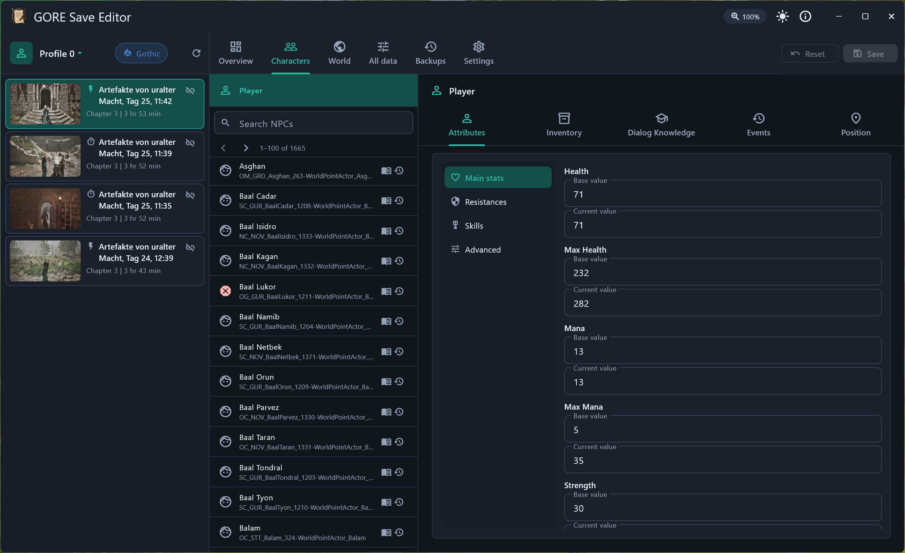

# gore-save

`gore-save` (the `goresave` app) is a savegame editor for Gothic Remake. It
provides a Flutter interface backed by a Rust savegame core. It is one project
in the [gore-tools](../../README.md) monorepo.

## Features

- Profile: Change difficulty settings
- Player: Edit stats, skills, location and much more
- Inventory: Change count of existing items; add new items from a bundled catalog with categorized browsing.
- Progression: Edit quest markers, NPC knowledge and events
- Almost all data can be changed by changing the value of the internal property. Only for experimental use.
- Automatic backup creation.

## Screenshots

[](../../docs/images/screenshot_light.png)
[](../../docs/images/screenshot_dark.png)

## Compatibility

Tested with Steam game version CL168781. Should work with all versions.

## Installation & Updates

Download `GoresaveSetup-<version>.exe` from the
[latest release](https://github.com/dh0er/gore/releases/latest) and run it.
The app checks for updates on startup and prompts you when a new version is
available.

A portable zip is also attached to each release; the portable build does not
auto-update.

## Requirements

- Windows 10 or newer.
- Rust toolchain.
- Flutter with Windows desktop support.
- Visual Studio 2022 with Desktop development with C++.

The local development setup used for this repository is Flutter 3.44.0, Dart
3.12.0, and Rust 1.96.0.

## Build And Test

All commands run from this directory (`projects/gore-save/`). `cargo` resolves
the workspace at the monorepo root automatically.

Run the gore-save test suite:

```powershell
python test.py
```

Build the Rust native artifacts:

```powershell
cargo build
```

Run the Flutter app:

```powershell
cd app
flutter run -d windows
```

Build a Windows release bundle:

```powershell
cargo build --release
cd app
flutter build windows --release
cd ..
python tools\build_native.py --release --bundle-windows
```

## Safety

`gore-save` writes backups before modifying save files. Even so, keep your own
copy of important saves before editing them.

## License

This project is licensed under the MIT License. See [LICENSE](../../LICENSE).
